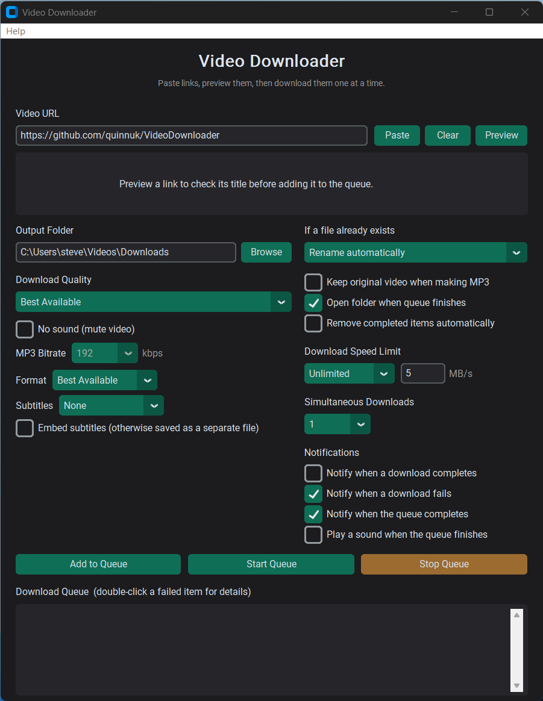

# 🎬 Video Downloader Pro

A modern Windows video downloader with a simple, user-friendly interface powered by **yt-dlp**.

Download videos and audio from your favourite websites with support for thousands of online platforms.

[](https://img.shields.io/badge/platform-Windows-blue) [](https://img.shields.io/badge/python-3.x-yellow) [](LICENSE)

<p align="center">
  <a href="https://buymeacoffee.com/quinnuk" target="_blank">
    
  </a>
  <br>
  <sub>If Video Downloader Pro saves you time, a coffee is always appreciated ☕</sub>
</p>

---

## ✨ Features

### 🎥 Video Downloads

- Download videos from YouTube, Vimeo, TikTok, Reddit, Facebook, X/Twitter and many more
- Powered by the reliable **yt-dlp** engine
- Supports thousands of websites
- Paste a playlist link to add every video in it to the queue at once

### 👀 Video Preview

Before downloading, preview:

- Video title
- Creator/uploader
- Duration
- Thumbnail

### 📥 Download Management

- Multiple download queue
- Live progress tracking
- Download speed display
- Remaining time estimate
- Pause-friendly workflow

### 🎵 Audio Extraction

- Extract audio as MP3
- Choose your MP3 bitrate (128 / 192 / 256 / 320 kbps)
- Select download quality
- Keep your preferred settings

### ⚙️ Smart Features

- Remembers your settings
- Clipboard URL detection
- Handles duplicate files
- Simple Windows desktop interface

---

## 🖥 Screenshots



---

## 📦 Installation

### Option 1 — Installer (Recommended)

[](https://github.com/quinnuk/VideoDownloader/releases/latest/download/VideoDownloader-Setup.exe)

Run the installer and follow the instructions. FFmpeg is bundled, so there's nothing extra to install.

> **Note:** Since this app isn't code-signed, Windows SmartScreen may show a "Windows protected your PC" warning the first time you run the installer. This is normal for small independent apps — click **More info**, then **Run anyway** to continue.

### Option 2 — Run from Source

Requirements:

- Windows 10/11
- Python 3.x
- **[FFmpeg](https://ffmpeg.org/download.html)** — required for merging video/audio streams and MP3 extraction. Must be on your system `PATH`.

Install dependencies:

```
pip install -r requirements.txt
```

Then launch the app:

```
python main.py
```

Or on Windows, just double-click `run.bat`.

---

## ▶️ Usage

1. Paste a video link into the **Video URL** box (or copy one — it's detected automatically).
2. Click **Preview** to check the title, uploader, duration, and thumbnail before downloading. Pasting a playlist link shows the video count instead, and lets you add the whole playlist or just that one link.
3. Choose your **Download Quality** (Best Available, Up to 1080p, or Audio Only/MP3) and output folder. If you pick Audio Only, you can also set the **MP3 Bitrate**.
4. Click **Add to Queue** — repeat for as many links as you like.
5. Click **Start Queue** to begin downloading. Progress, speed, and ETA are shown live.
6. Once finished, use **Open Selected File** or **Open Selected Folder** to jump straight to your download.

---

## ☕ Support This Project

Video Downloader Pro is free and built in my spare time. If it's useful to you, consider buying me a coffee — it's a big help and genuinely appreciated.

<p align="center">
  <a href="https://buymeacoffee.com/quinnuk" target="_blank">
    
  </a>
</p>
